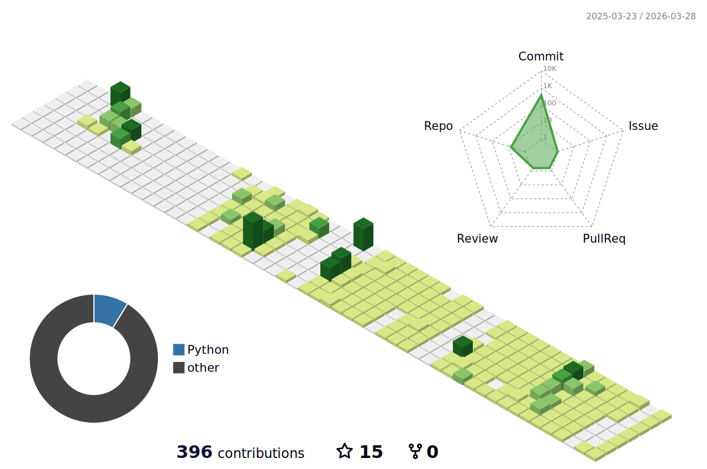

<h1 align="center">
  Овчинников Олег | JS и React разработка
</h1>

<h3 align="center">
  
1 год профессиональной разработки на JavaScript и PowerShell 
  1 год фриланса и 3 года в WEB-разработке

</h3>

<table width="100%">
    <tr>
      <td>
        

          <a id="" class="anchor" aria-hidden="true" tabindex="-1" href="#">
            <svg class="octicon octicon-link" viewBox="0 0 16 16" version="1.1" width="16" height="16" aria-hidden="true">
              <path d="m7.775 3.275 1.25-1.25a3.5 3.5 0 1 1 4.95 4.95l-2.5 2.5a3.5 3.5 0 0 1-4.95 0 .751.751 0 0 1 .018-1.042.751.751 0 0 1 1.042-.018 1.998 1.998 0 0 0 2.83 0l2.5-2.5a2.002 2.002 0 0 0-2.83-2.83l-1.25 1.25a.751.751 0 0 1-1.042-.018.751.751 0 0 1-.018-1.042Zm-4.69 9.64a1.998 1.998 0 0 0 2.83 0l1.25-1.25a.751.751 0 0 1 1.042.018.751.751 0 0 1 .018 1.042l-1.25 1.25a3.5 3.5 0 1 1-4.95-4.95l2.5-2.5a3.5 3.5 0 0 1 4.95 0 .751.751 0 0 1-.018 1.042.751.751 0 0 1-1.042.018 1.998 1.998 0 0 0-2.83 0l-2.5 2.5a1.998 1.998 0 0 0 0 2.83Z"> 
              </path>
            </svg>
          </a>
          
        

      </td>
      <td>
        

          
          
          
        

      </td>
    </tr>
</table>

---

  

  <b>Nice to see you! Немного о себе:</b>

 

Я - JavaScript и React-разработчик 
По своей основной деятельности занимаюсь поддержкой корпоративных систем, 
а так же профессиональной разработкой на стеке 
<b>Misrosoft SQL Server + PowerShell + Native JavaScript</b>. 
Реализовал проект "Электронный журнал" по учету передачи между сотрудниками 
корпоративных ноутбуков (SQL Server + PS Polaris + Native JS) 
В свободное от работы время веду собственные JS-проекты 
С ними Вы сможете ознакомиться на данной странице 
Люблю решать интересные JS-задачи, прокачивая логику и алгоритмы 
С удовольствием провожу время с женой

---

### :hammer_and_wrench: Языки и технологии:

<table border="0" width="100%">
  <tbody border="0">
    <tr border="0" >
      <td border="0">
        

          
          &nbsp;
          
          &nbsp;
          
          &nbsp;
          
          &nbsp;
          
        

        

          
          &nbsp;
          
        

        

          
          &nbsp;
          
          &nbsp;
          
        
  
        

          
          &nbsp;
          
          &nbsp;
          
          &nbsp;
          
          &nbsp;
          
        

      </td>
      <td border="0" bordercolor="white">
        

          
        

      </td>
    </tr>
  </tbody>
</table>

---

### 🧾 Мои репозитории:

---

### ✍️ Мои коммиты:

